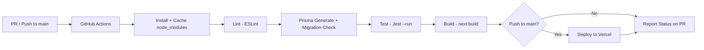

# Design Document: Stellar Advanced Features

## Overview

This design covers five capability areas for the StellarPe application:

1. **CI/CD Pipeline** — A GitHub Actions workflow that automates linting, testing, building, Prisma migration checks, and auto-deployment to Vercel on every PR and push to `main`.
2. **Soroban Contract Service** — A backend service for deploying pre-compiled WASM binaries and invoking Soroban smart contract functions (including inter-contract calls) from the Next.js API layer using `@stellar/stellar-sdk` v15.
3. **Token Service** — Deployment of SEP-41 token contracts and balance queries via Soroban RPC.
4. **Pool Service** — Liquidity pool contract interactions: deposit, withdraw, and swap using a constant-product formula.
5. **Dashboard UI** — Token balance and LP position display on Merchant and User dashboards.

Requirements 11 (event streaming) and 12 (mobile responsive) are already implemented. This design does not propose changes to those features.

The Rust smart contract code itself is **out of scope**. This design focuses on the Next.js backend services that interact with pre-compiled contract WASM binaries.

### Key Technology Choices

| Concern | Choice | Rationale |
|---|---|---|
| Contract interaction | `@stellar/stellar-sdk` v15 `Client` + `Server` from `@stellar/stellar-sdk/rpc` | Official SDK with built-in contract client, simulation, and XDR handling |
| Soroban RPC | `https://soroban-testnet.stellar.org` | Official testnet RPC endpoint |
| CI/CD | GitHub Actions | Native GitHub integration, free for public repos, YAML-based |
| Deployment | Vercel CLI via `vercel deploy --prod` | Matches existing Vercel hosting; token-based deploy from CI |
| PBT library | `fast-check` (already in devDependencies) | Already used in the project |

---

## Architecture

The new services follow the existing layered architecture:

```
┌─────────────────────────────────────────────────────────┐
│                    Client (Browser)                       │
│  Dashboard UI  ─  Token Balances  ─  LP Positions        │
└──────────────────────┬──────────────────────────────────┘
                       │ fetch()
┌──────────────────────▼──────────────────────────────────┐
│              Next.js API Routes (App Router)              │
│  /api/contracts/*  /api/tokens/*  /api/pools/*           │
│  Edge Middleware (proxy.ts) → JWT auth headers            │
└──────────────────────┬──────────────────────────────────┘
                       │
┌──────────────────────▼──────────────────────────────────┐
│                   Service Layer                           │
│  ContractService  TokenService  PoolService              │
│  (+ existing: StellarService, PaymentService, etc.)      │
└───────┬──────────────┬──────────────────┬───────────────┘
        │              │                  │
   ┌────▼────┐   ┌─────▼─────┐    ┌──────▼──────┐
   │ Soroban │   │  Prisma   │    │  Horizon    │
   │   RPC   │   │ PostgreSQL│    │   API       │
   └─────────┘   └───────────┘    └─────────────┘
```

### CI/CD Pipeline Architecture



The workflow uses a single job with sequential steps. A PostgreSQL service container provides the test database. `node_modules` is cached by `package-lock.json` hash.

---

## Components and Interfaces

### 1. CI/CD Pipeline (`/.github/workflows/ci.yml`)

A single GitHub Actions workflow file with one job:

**Job: `ci`**
- **Runs on:** `ubuntu-latest`
- **Services:** PostgreSQL 16 container (`postgres:16`) with health checks
- **Environment variables:** `DATABASE_URL`, `JWT_SECRET`, `ENCRYPTION_MASTER_KEY`, `HORIZON_URL`, `STELLAR_NETWORK_PASSPHRASE` — set from GitHub Secrets for the test step
- **Steps:**
  1. `actions/checkout@v4`
  2. `actions/setup-node@v4` (Node 22)
  3. Cache `node_modules` using `actions/cache@v4` with key `node-modules-${{ hashFiles('package-lock.json') }}`
  4. `npm ci` (skip if cache hit)
  5. `npm run lint`
  6. `npx prisma generate`
  7. `npx prisma migrate diff --from-schema-datamodel prisma/schema.prisma --to-migrations prisma/migrations --exit-code` (fails if drift detected)
  8. `npm test -- --run` (Jest single execution)
  9. `npm run build` (runs `prisma generate && next build`)
  10. **Conditional on push to main:** `npx vercel deploy --prod --token=${{ secrets.VERCEL_TOKEN }}`

**Secrets required:** `VERCEL_TOKEN`, `VERCEL_ORG_ID`, `VERCEL_PROJECT_ID`, `DATABASE_URL`, `JWT_SECRET`, `ENCRYPTION_MASTER_KEY`

Vercel environment variables (database URL, JWT secret, Stellar config) are configured in the Vercel dashboard, not hardcoded in the workflow.

---

### 2. Contract Service (`src/lib/services/contract.service.ts`)

Handles Soroban contract deployment and invocation using the `@stellar/stellar-sdk` v15 `Client` class and `Server` from `@stellar/stellar-sdk/rpc`.

```typescript
// Public API

/** Deploy a pre-compiled WASM binary to Stellar testnet */
export async function deployContract(
  wasmBuffer: Buffer,
  deployerSecret: string
): Promise<{ contractId: string; transactionHash: string }>

/** Invoke a contract function (state-changing, submits transaction) */
export async function invokeContract(
  contractId: string,
  functionName: string,
  args: xdr.ScVal[],
  callerSecret: string,
  subAuth?: SubContractAuth[]
): Promise<{ transactionHash: string; returnValue: xdr.ScVal }>

/** Simulate a contract call (read-only, no transaction submitted) */
export async function simulateContract(
  contractId: string,
  functionName: string,
  args: xdr.ScVal[]
): Promise<{ returnValue: xdr.ScVal }>
```

**Design decisions:**
- Uses `Client.deploy()` for WASM upload + instantiation in a single call, returning the contract ID.
- Uses `Client.from()` to create a typed client for existing contracts, then calls methods via `signAndSend()`.
- For inter-contract calls, the `subAuth` parameter allows specifying sub-contract authorization entries that get included in the transaction envelope.
- Read-only calls use `simulateTransaction` on the RPC server — no transaction is submitted to the ledger.
- XDR serialization/deserialization uses `nativeToScVal` and `scValToNative` from `@stellar/stellar-sdk`.
- Environment config (`SOROBAN_RPC_URL`, `STELLAR_NETWORK_PASSPHRASE`) is read from `process.env` at call time, matching the existing `stellar.service.ts` pattern.

**Error handling:**
- Deployment failures return the Stellar network rejection reason from the RPC response.
- Invocation failures return the Soroban runtime error code and diagnostic message.
- Inter-contract authorization failures identify which sub-contract authorization is missing by inspecting the simulation's `auth` entries.

---

### 3. Token Service (`src/lib/services/token.service.ts`)

Wraps `ContractService` for SEP-41 token-specific operations.

```typescript
/** Deploy a new SEP-41 token contract and mint initial supply */
export async function createToken(params: {
  name: string;
  symbol: string;
  decimals: number;
  initialSupply: string;
  merchantId: string;
}): Promise<{ contractId: string; transactionHash: string }>

/** Query token balance for an address via Soroban RPC */
export async function getTokenBalance(
  contractId: string,
  address: string
): Promise<string>

/** Query all token balances for a user */
export async function getUserTokenBalances(
  userId: string
): Promise<Array<{ contractId: string; name: string; symbol: string; decimals: number; balance: string }>>
```

**Design decisions:**
- `createToken` deploys the pre-compiled SEP-41 WASM, then invokes `initialize(admin, decimals, name, symbol)` and `mint(to, amount)` in sequence.
- The deployer keypair is the merchant's encrypted secret key, decrypted via `EncryptionService` for signing.
- Decimal validation (0–18 range) happens at the validator layer before reaching the service.
- `getTokenBalance` calls `simulateContract` with the `balance(address)` function — a read-only call.
- `getUserTokenBalances` queries the `Token` table for all tokens associated with the user, then batch-queries balances via Soroban RPC.

---

### 4. Pool Service (`src/lib/services/pool.service.ts`)

Handles liquidity pool contract interactions.

```typescript
/** Deploy a new liquidity pool contract for two tokens */
export async function deployPool(params: {
  tokenAContractId: string;
  tokenBContractId: string;
  deployerSecret: string;
}): Promise<{ poolContractId: string; transactionHash: string }>

/** Deposit tokens into a liquidity pool */
export async function deposit(params: {
  poolContractId: string;
  amountA: string;
  amountB: string;
  merchantId: string;
  pin: string;
}): Promise<{ shares: string; transactionHash: string }>

/** Withdraw tokens from a liquidity pool */
export async function withdraw(params: {
  poolContractId: string;
  shares: string;
  merchantId: string;
  pin: string;
}): Promise<{ amountA: string; amountB: string; transactionHash: string }>

/** Swap tokens through a liquidity pool */
export async function swap(params: {
  poolContractId: string;
  inputToken: string;
  inputAmount: string;
  minOutputAmount: string;
  userId: string;
  pin: string;
}): Promise<{ outputAmount: string; effectiveRate: string; feeAmount: string; transactionHash: string }>
```

**Design decisions:**
- Deposit invokes the pool contract's `deposit(depositor, amount_a, amount_b, min_shares)` function. The pool contract enforces the 1% slippage tolerance on reserve ratio internally.
- Withdrawal invokes `withdraw(withdrawer, shares, min_a, min_b)` which burns shares and returns proportional token amounts.
- Swap invokes `swap(user, input_token, input_amount, min_output)`. The 0.3% fee is deducted by the contract before calculating output via `x * y = k`. If the calculated output is below `minOutputAmount`, the service rejects the swap **before** submitting the transaction by using `simulateContract` first.
- Both deposit and withdraw require PIN verification (reusing `PINService.verifyPin`) and secret key decryption (reusing `EncryptionService`).
- Inter-contract calls (pool contract calling token contracts for `transfer`) are handled by including token contract authorizations in the `subAuth` parameter.

---

### 5. API Routes

New routes follow the existing pattern: Edge middleware provides `x-user-id` / `x-user-role` headers, route handlers apply role guards and rate limiting.

| Route | Method | Auth | Roles | Description |
|---|---|---|---|---|
| `/api/contracts/deploy` | POST | JWT | MERCHANT | Deploy a WASM contract |
| `/api/contracts/invoke` | POST | JWT | USER, MERCHANT | Invoke a contract function |
| `/api/contracts/simulate` | POST | JWT | USER, MERCHANT | Simulate a contract call (read-only) |
| `/api/tokens/create` | POST | JWT | MERCHANT | Create a SEP-41 token |
| `/api/tokens/balances` | GET | JWT | USER, MERCHANT | Get all token balances |
| `/api/pools/deposit` | POST | JWT | MERCHANT | Deposit into a liquidity pool |
| `/api/pools/withdraw` | POST | JWT | MERCHANT | Withdraw from a liquidity pool |
| `/api/pools/swap` | POST | JWT | USER, MERCHANT | Swap tokens via a pool |
| `/api/pools/positions` | GET | JWT | MERCHANT | Get LP positions |

**Validation schemas** (Zod, in `src/lib/validators/`):

- `contract.validator.ts` — deploy (wasmBase64, constructorArgs), invoke (contractId, functionName, args, subAuth), simulate
- `token.validator.ts` — create (name 1–32 chars, symbol 1–12 chars, decimals 0–18, initialSupply positive), balances (no body)
- `pool.validator.ts` — deposit (poolContractId, amountA, amountB, pin), withdraw (poolContractId, shares, pin), swap (poolContractId, inputToken, inputAmount, minOutputAmount, pin)

---

### 6. Dashboard UI Components

**New components:**

- `TokenBalanceList` — Renders a list of token balances with name, symbol, and formatted balance. Shows empty state when no tokens are held.
- `LPPositionList` — Renders LP positions with pool name, deposited amounts, share value, and earned fees. Shows empty state when no positions exist.

**Integration into existing dashboards:**

- `src/app/(dashboard)/merchant/page.tsx` — Add `TokenBalanceList` and `LPPositionList` sections below the existing stats cards.
- `src/app/(dashboard)/user/page.tsx` — Add `TokenBalanceList` section below the balance card.

**Data fetching:** Client-side `fetch()` on mount, calling `/api/tokens/balances` and `/api/pools/positions`. Results are cached in component state with a 60-second staleness window (re-fetch on mount if last fetch was >60s ago).

---

## Data Models

### New Prisma Models

```prisma
model Contract {
  id              String   @id @default(cuid())
  contractId      String   @unique          // Soroban contract ID (C... address)
  contractType    String                     // "TOKEN", "POOL", "CUSTOM"
  wasmHash        String                     // Hash of the deployed WASM
  deployerAddress String                     // Stellar address of deployer
  deployerId      String                     // User ID of deployer
  deployTxHash    String                     // Stellar transaction hash
  metadata        Json?                      // Flexible metadata (e.g. token name/symbol)
  createdAt       DateTime @default(now())

  deployer        User     @relation(fields: [deployerId], references: [id])

  @@index([deployerId])
  @@index([contractType])
}

model Token {
  id          String   @id @default(cuid())
  contractId  String   @unique              // Soroban contract ID
  name        String                         // Token display name
  symbol      String                         // Token ticker symbol
  decimals    Int                             // Decimal precision (0-18)
  deployerId  String                         // Merchant who created the token
  createdAt   DateTime @default(now())

  deployer    User     @relation(fields: [deployerId], references: [id])

  @@index([deployerId])
  @@index([symbol])
}

model LPPosition {
  id              String   @id @default(cuid())
  poolContractId  String                     // Soroban pool contract ID
  merchantId      String                     // Merchant who deposited
  shares          Decimal  @db.Decimal(38, 0) // LP share amount (i128)
  tokenAContractId String                    // First token contract ID
  tokenBContractId String                    // Second token contract ID
  createdAt       DateTime @default(now())
  updatedAt       DateTime @updatedAt

  merchant        User     @relation(fields: [merchantId], references: [id])

  @@index([merchantId])
  @@index([poolContractId])
  @@unique([poolContractId, merchantId])
}

model SwapTransaction {
  id              String   @id @default(cuid())
  poolContractId  String
  userId          String
  inputToken      String                     // Input token contract ID
  outputToken     String                     // Output token contract ID
  inputAmount     Decimal  @db.Decimal(38, 18)
  outputAmount    Decimal  @db.Decimal(38, 18)
  feeAmount       Decimal  @db.Decimal(38, 18)
  stellarTxHash   String?  @unique
  createdAt       DateTime @default(now())

  user            User     @relation(fields: [userId], references: [id])

  @@index([userId])
  @@index([poolContractId])
  @@index([createdAt])
}
```

### User Model Updates

Add relations to the existing `User` model:

```prisma
model User {
  // ... existing fields ...
  contracts        Contract[]
  tokens           Token[]
  lpPositions      LPPosition[]
  swapTransactions SwapTransaction[]
}
```

---

## Existing Features (No Changes)

### Requirement 11: Advanced Event Streaming

Already implemented in `src/lib/services/notification.service.ts` and `src/app/api/events/stream/route.ts`. The SSE endpoint, Horizon streaming, exponential backoff reconnection, and one-connection-per-user logic are all in place. No changes proposed.

### Requirement 12: Mobile Responsive Design

Already implemented across all dashboard pages using Tailwind CSS v4 mobile-first utilities, the `BottomNav` component with role-specific navigation, and glassmorphism design elements. No changes proposed.

---
