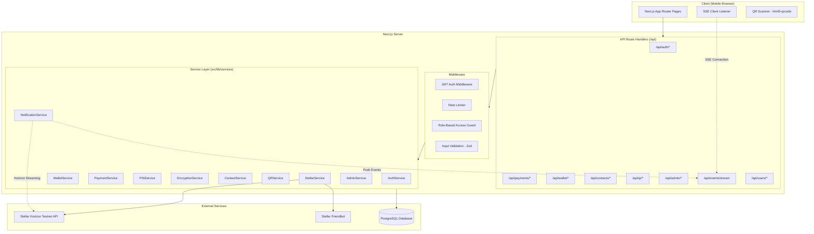
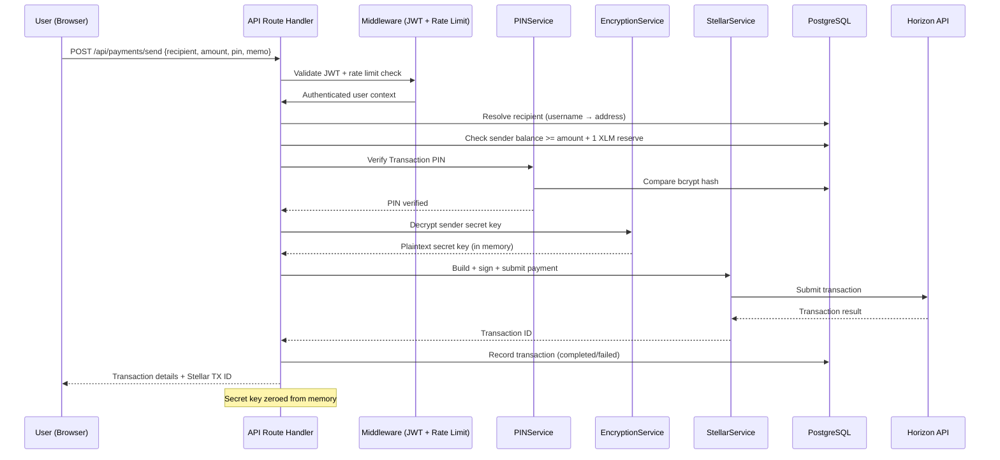
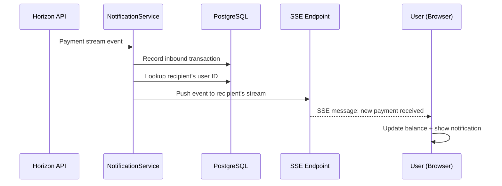
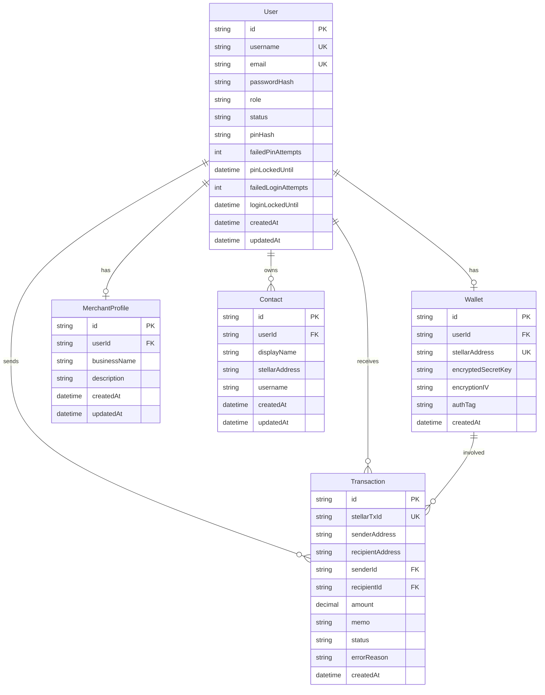

# Design Document: StellarPay

## Overview

StellarPay is a mobile-first payment web application inspired by UPI, built on the Stellar blockchain testnet with a custodial wallet model. The system eliminates the need for browser wallet extensions by managing all cryptographic operations server-side, making it accessible on any mobile browser.

The architecture follows a monolithic Next.js application pattern with:
- **Frontend**: Next.js App Router with Tailwind CSS for a mobile-first responsive UI
- **Backend**: Next.js API Route Handlers for all business logic
- **Database**: PostgreSQL with Prisma ORM for structured data persistence
- **Blockchain**: Stellar SDK (`@stellar/stellar-sdk`) for testnet interactions via Horizon API
- **Auth**: Stateless JWT authentication with bcrypt-hashed passwords
- **Real-time**: Server-Sent Events (SSE) for payment notifications (chosen over WebSockets for compatibility with Next.js serverless-friendly architecture)

### Key Design Decisions

1. **SSE over WebSockets**: Next.js App Router API routes are serverless-compatible. SSE works naturally with HTTP streaming in Route Handlers, while WebSockets require a separate server process. SSE is sufficient since we only need server-to-client push for payment notifications.

2. **Custodial wallet with AES-256-GCM**: Secret keys are generated, encrypted, and stored entirely on the backend. The encryption key is derived from a master secret in environment variables using HKDF, with a unique IV per encryption operation. Plaintext keys exist in memory only during transaction signing.

3. **PIN-based authorization**: A UPI MPIN-style Transaction PIN (4–6 digits) adds a second factor for payment authorization. The PIN is bcrypt-hashed (cost factor 12+) and verified before any secret key decryption. Rate-limited to 5 attempts per 15-minute window.

4. **QR code libraries**: `qrcode` (server-side PNG generation) and `qrcode.react` (client-side SVG rendering) for generation; `html5-qrcode` for camera-based scanning on mobile browsers.

5. **Stellar Horizon streaming**: The backend maintains persistent SSE connections to Horizon for each registered Stellar address, relaying inbound payment events to connected clients via the application's own SSE endpoint.

---

## Architecture

### High-Level Architecture



### Request Flow: Send Payment



### Notification Flow: Receive Payment



---

## Components and Interfaces

### Service Layer

#### AuthService (`src/lib/services/auth.service.ts`)

| Method | Input | Output | Description |
|--------|-------|--------|-------------|
| `register(data)` | `{ username, email, password, role }` | `{ user, token }` | Creates user, triggers wallet creation, returns JWT |
| `login(data)` | `{ email, password }` | `{ token, user }` | Validates credentials, checks lockout, returns JWT |
| `validateToken(token)` | `string` | `{ userId, role }` | Verifies JWT signature and expiry |

#### WalletService (`src/lib/services/wallet.service.ts`)

| Method | Input | Output | Description |
|--------|-------|--------|-------------|
| `createWallet(userId)` | `string` | `{ publicKey }` | Generates keypair, funds via Friendbot, encrypts and stores secret key |
| `getWalletDetails(userId)` | `string` | `{ stellarAddress, balance }` | Returns public key and live XLM balance from Horizon |
| `decryptSecretKey(userId)` | `string` | `string` | Decrypts secret key for transaction signing (internal only) |

#### PaymentService (`src/lib/services/payment.service.ts`)

| Method | Input | Output | Description |
|--------|-------|--------|-------------|
| `sendPayment(data)` | `{ senderId, recipient, amount, pin, memo? }` | `{ transaction }` | Full payment flow: resolve, verify PIN, sign, submit, record |
| `resolveRecipient(identifier)` | `string` | `{ stellarAddress }` | Resolves username to Stellar address |
| `getTransactionHistory(userId, filters)` | `{ userId, page, dateRange?, direction?, status? }` | `{ transactions, pagination }` | Paginated filtered transaction list |

#### PINService (`src/lib/services/pin.service.ts`)

| Method | Input | Output | Description |
|--------|-------|--------|-------------|
| `setPin(userId, pin)` | `string, string` | `void` | Hashes and stores PIN (bcrypt, cost 12) |
| `verifyPin(userId, pin)` | `string, string` | `boolean` | Checks PIN against hash, tracks failed attempts |
| `isLocked(userId)` | `string` | `boolean` | Checks if account is in PIN lockout period |
| `resetPin(userId, newPin)` | `string, string` | `void` | Updates PIN hash, invalidates sessions |

#### EncryptionService (`src/lib/services/encryption.service.ts`)

| Method | Input | Output | Description |
|--------|-------|--------|-------------|
| `encrypt(plaintext)` | `string` | `{ ciphertext, iv, authTag }` | AES-256-GCM encryption with random IV |
| `decrypt(ciphertext, iv, authTag)` | `string, string, string` | `string` | AES-256-GCM decryption and authentication |

#### StellarService (`src/lib/services/stellar.service.ts`)

| Method | Input | Output | Description |
|--------|-------|--------|-------------|
| `generateKeypair()` | — | `{ publicKey, secretKey }` | Generates Stellar keypair |
| `fundAccount(publicKey)` | `string` | `void` | Funds account via Friendbot (with 3 retries) |
| `getBalance(publicKey)` | `string` | `string` | Queries Horizon for XLM balance |
| `submitPayment(senderSecret, recipientPublic, amount, memo?)` | `string, string, string, string?` | `{ transactionId }` | Builds, signs, submits payment operation |
| `streamPayments(publicKey, onPayment)` | `string, callback` | `void` | Opens Horizon streaming cursor for inbound payments |

#### ContactService (`src/lib/services/contact.service.ts`)

| Method | Input | Output | Description |
|--------|-------|--------|-------------|
| `createContact(userId, data)` | `string, { name, address }` | `{ contact }` | Validates and saves contact |
| `listContacts(userId)` | `string` | `Contact[]` | Returns contacts alphabetically |
| `updateContact(userId, contactId, data)` | `string, string, Partial<Contact>` | `{ contact }` | Updates contact fields |
| `deleteContact(userId, contactId)` | `string, string` | `void` | Removes contact |

#### QRService (`src/lib/services/qr.service.ts`)

| Method | Input | Output | Description |
|--------|-------|--------|-------------|
| `generateStaticQR(stellarAddress)` | `string` | `Buffer` | Generates PNG QR encoding the address |
| `generateDynamicQR(stellarAddress, amount, description?)` | `string, string, string?` | `Buffer` | Generates PNG QR with address + amount + description |
| `parseQRPayload(data)` | `string` | `{ address, amount?, description? }` | Parses and validates QR payload |

#### NotificationService (`src/lib/services/notification.service.ts`)

| Method | Input | Output | Description |
|--------|-------|--------|-------------|
| `subscribe(userId, controller)` | `string, ReadableStreamController` | `void` | Registers SSE connection for a user |
| `unsubscribe(userId)` | `string` | `void` | Removes SSE connection |
| `notifyPaymentReceived(userId, transaction)` | `string, Transaction` | `void` | Pushes payment event to user's SSE stream |
| `startHorizonStreaming()` | — | `void` | Initializes Horizon payment streams for all registered addresses |

#### AdminService (`src/lib/services/admin.service.ts`)

| Method | Input | Output | Description |
|--------|-------|--------|-------------|
| `getDashboardStats()` | — | `{ userCount, merchantCount, txCount, volume, failedLast24h }` | Aggregated platform metrics |
| `listUsers(page, search?)` | `number, string?` | `{ users, pagination }` | Paginated user list with optional search |
| `setAccountStatus(userId, status)` | `string, 'active' \| 'inactive'` | `void` | Activates or deactivates an account |

### API Route Handlers

| Route | Method | Auth | Role | Description |
|-------|--------|------|------|-------------|
| `/api/auth/register` | POST | No | — | User/Merchant registration |
| `/api/auth/login` | POST | No | — | Login, returns JWT |
| `/api/wallet` | GET | Yes | User, Merchant | Get wallet details + balance |
| `/api/payments/send` | POST | Yes | User | Send payment |
| `/api/payments/history` | GET | Yes | User, Merchant | Transaction history with filters |
| `/api/contacts` | GET, POST | Yes | User | List / create contacts |
| `/api/contacts/[id]` | PUT, DELETE | Yes | User | Update / delete contact |
| `/api/qr/static` | GET | Yes | Merchant | Generate static QR |
| `/api/qr/dynamic` | POST | Yes | Merchant | Generate dynamic QR |
| `/api/qr/parse` | POST | Yes | User | Parse scanned QR data |
| `/api/users/search` | GET | Yes | User | Username autocomplete |
| `/api/users/pin` | POST, PUT | Yes | User | Set / reset Transaction PIN |
| `/api/admin/dashboard` | GET | Yes | Admin | Platform stats |
| `/api/admin/users` | GET | Yes | Admin | Paginated user management |
| `/api/admin/users/[id]/status` | PUT | Yes | Admin | Activate/deactivate account |
| `/api/events/stream` | GET | Yes | User, Merchant | SSE endpoint for real-time notifications |

### Middleware Stack

1. **JWT Authentication** (`src/middleware.ts`): Validates Bearer token on all `/api/*` routes except `/api/auth/*`. Attaches `userId` and `role` to request context.

2. **Rate Limiter** (`src/lib/middleware/rate-limiter.ts`): In-memory sliding window rate limiter (upgradeable to Redis). Auth endpoints: 10 req/IP/min. Payment endpoints: 20 req/user/min.

3. **Role Guard** (`src/lib/middleware/role-guard.ts`): Validates the user's role against the required role for each route. Returns 403 for unauthorized access.

4. **Input Validation** (`src/lib/middleware/validator.ts`): Zod schemas validate all request bodies and query parameters. Returns 400 with structured error messages.

### Frontend Components

```
src/
├── app/
│   ├── (auth)/
│   │   ├── login/page.tsx
│   │   └── register/page.tsx
│   ├── (dashboard)/
│   │   ├── user/
│   │   │   ├── page.tsx              # User dashboard
│   │   │   ├── send/page.tsx         # Send payment form
│   │   │   ├── scan/page.tsx         # QR scanner
│   │   │   ├── contacts/page.tsx     # Contact management
│   │   │   ├── history/page.tsx      # Transaction history
│   │   │   └── profile/page.tsx      # Profile + PIN management
│   │   ├── merchant/
│   │   │   ├── page.tsx              # Merchant dashboard
│   │   │   ├── qr/page.tsx           # QR code management
│   │   │   ├── transactions/page.tsx # Transaction list
│   │   │   ├── analytics/page.tsx    # Earnings analytics
│   │   │   └── profile/page.tsx      # Merchant profile
│   │   └── admin/
│   │       ├── page.tsx              # Admin dashboard
│   │       └── users/page.tsx        # User management
│   ├── api/                          # API Route Handlers
│   └── layout.tsx
├── components/
│   ├── ui/                           # Reusable UI primitives
│   │   ├── Button.tsx
│   │   ├── Input.tsx
│   │   ├── Card.tsx
│   │   ├── Modal.tsx
│   │   └── PinInput.tsx              # Numeric PIN input
│   ├── BottomNav.tsx                 # Mobile bottom navigation
│   ├── QRCodeDisplay.tsx             # QR code renderer (qrcode.react)
│   ├── QRScanner.tsx                 # Camera QR scanner (html5-qrcode)
│   ├── TransactionList.tsx           # Shared transaction display
│   ├── BalanceCard.tsx               # XLM balance display
│   └── UsernameAutocomplete.tsx      # Recipient search
└── lib/
    ├── services/                     # Backend service layer
    ├── middleware/                    # API middleware
    ├── prisma.ts                     # Prisma client singleton
    ├── stellar.ts                    # Stellar SDK configuration
    ├── validators/                   # Zod schemas
    └── utils/                        # Shared utilities
```

---

## Data Models

### Prisma Schema



### Prisma Model Definitions

```prisma
generator client {
  provider = "prisma-client-js"
}

datasource db {
  provider = "postgresql"
  url      = env("DATABASE_URL")
}

enum Role {
  USER
  MERCHANT
  ADMIN
}

enum AccountStatus {
  ACTIVE
  INACTIVE
}

enum TransactionStatus {
  COMPLETED
  FAILED
}

model User {
  id                  String        @id @default(cuid())
  username            String        @unique
  email               String        @unique
  passwordHash        String
  role                Role          @default(USER)
  status              AccountStatus @default(ACTIVE)
  pinHash             String?
  failedPinAttempts   Int           @default(0)
  pinLockedUntil      DateTime?
  failedLoginAttempts Int           @default(0)
  loginLockedUntil    DateTime?
  createdAt           DateTime      @default(now())
  updatedAt           DateTime      @updatedAt

  wallet              Wallet?
  merchantProfile     MerchantProfile?
  contacts            Contact[]
  sentTransactions    Transaction[] @relation("sender")
  receivedTransactions Transaction[] @relation("recipient")

  @@index([username])
  @@index([email])
}

model Wallet {
  id                 String   @id @default(cuid())
  userId             String   @unique
  stellarAddress     String   @unique
  encryptedSecretKey String
  encryptionIV       String
  authTag            String
  createdAt          DateTime @default(now())

  user               User     @relation(fields: [userId], references: [id])

  @@index([stellarAddress])
}

model Transaction {
  id               String            @id @default(cuid())
  stellarTxId      String?           @unique
  senderAddress    String
  recipientAddress String
  senderId         String?
  recipientId      String?
  amount           Decimal           @db.Decimal(20, 7)
  memo             String?
  status           TransactionStatus
  errorReason      String?
  createdAt        DateTime          @default(now())

  sender           User?             @relation("sender", fields: [senderId], references: [id])
  recipient        User?             @relation("recipient", fields: [recipientId], references: [id])

  @@index([senderId])
  @@index([recipientId])
  @@index([createdAt])
  @@index([senderAddress])
  @@index([recipientAddress])
}

model Contact {
  id             String   @id @default(cuid())
  userId         String
  displayName    String
  stellarAddress String?
  username       String?
  createdAt      DateTime @default(now())
  updatedAt      DateTime @updatedAt

  user           User     @relation(fields: [userId], references: [id])

  @@unique([userId, stellarAddress])
  @@unique([userId, username])
  @@index([userId])
}

model MerchantProfile {
  id           String   @id @default(cuid())
  userId       String   @unique
  businessName String
  description  String?
  createdAt    DateTime @default(now())
  updatedAt    DateTime @updatedAt

  user         User     @relation(fields: [userId], references: [id])
}
```

### Key Data Model Decisions

1. **Decimal(20,7) for amount**: Stellar supports 7 decimal places for XLM. Using Prisma Decimal ensures precision without floating-point errors.

2. **Separate encryption columns**: `encryptedSecretKey`, `encryptionIV`, and `authTag` are stored separately rather than concatenated. This avoids parsing ambiguity and makes the encryption contract explicit.

3. **Nullable senderId/recipientId on Transaction**: Supports recording transactions where one party is external (not a platform user). The `senderAddress`/`recipientAddress` fields always contain the Stellar addresses.

4. **Compound unique on Contact**: `(userId, stellarAddress)` and `(userId, username)` prevent a user from saving duplicate contacts.

5. **PIN lockout fields on User**: `failedPinAttempts` and `pinLockedUntil` are stored on the User model for simplicity. The PINService checks and resets these atomically.

---

## Correctness Properties

*A property is a characteristic or behavior that should hold true across all valid executions of a system — essentially, a formal statement about what the system should do. Properties serve as the bridge between human-readable specifications and machine-verifiable correctness guarantees.*

### Property 1: Registration creates user with linked wallet

*For any* valid registration payload (unique username, valid email, password, and role of USER or MERCHANT), the system should create a User record in the database and a corresponding Wallet record linked to that user, where the wallet contains a valid 56-character Stellar public key.

**Validates: Requirements 1.1, 1.3, 2.1**

### Property 2: Duplicate registration fields are rejected

*For any* registered user, attempting to register a new account with the same username or the same email should fail with a descriptive error indicating which field is duplicated, and no new user record should be created.

**Validates: Requirements 1.2**

### Property 3: JWT expiry is bounded

*For any* valid login, the returned JWT should be verifiable with the server's signing key and should have an expiry (`exp` claim) of no more than 24 hours from the time of issuance.

**Validates: Requirements 1.4**

### Property 4: Invalid credentials produce generic 401

*For any* login attempt with an incorrect password or non-existent email, the system should return a 401 status with a message that does not reveal whether the email or password was the incorrect field.

**Validates: Requirements 1.5**

### Property 5: Expired or absent JWT rejects with 401

*For any* authenticated API endpoint and any request with an expired JWT or no JWT at all, the system should return a 401 response without executing the endpoint's business logic.

**Validates: Requirements 1.6**

### Property 6: Missing registration fields listed in error

*For any* subset of required registration fields that is omitted from the request payload, the system should return a 400 response whose error body lists exactly the missing field names.

**Validates: Requirements 1.7**

### Property 7: Encryption round-trip preserves secret key

*For any* random string used as a secret key, encrypting it with the EncryptionService and then decrypting the result should produce the original plaintext string.

**Validates: Requirements 2.3**

### Property 8: Secret key never exposed in API responses or database plaintext

*For any* wallet in the database, the stored secret key column should contain only AES-256-GCM ciphertext (not the plaintext key), and *for any* API endpoint response that returns wallet information, the plaintext secret key should not appear in any response field.

**Validates: Requirements 2.1, 2.4, 2.7**

### Property 9: Username resolves to correct Stellar address

*For any* registered user with a username and an associated Stellar_Address, resolving that username through the PaymentService should return the exact Stellar_Address associated with that user's wallet.

**Validates: Requirements 3.1, 9.2**

### Property 10: Non-existent recipient identifier returns error

*For any* string that does not match a registered username and is not a valid funded Stellar address, attempting to resolve it as a payment recipient should fail with a descriptive error before any transaction is constructed.

**Validates: Requirements 3.2, 9.3**

### Property 11: Incorrect PIN rejects payment

*For any* user and any PIN value that does not match their stored bcrypt hash, submitting a payment request with that incorrect PIN should be rejected with an "incorrect PIN" error and no transaction should be signed or submitted.

**Validates: Requirements 3.4**

### Property 12: Transaction recording preserves status and data

*For any* payment operation, if the Horizon API accepts it the recorded transaction should have status "completed" with a non-null Stellar transaction ID, sender address, recipient address, amount, and timestamp. If the Horizon API rejects it, the recorded transaction should have status "failed" with a non-empty error reason.

**Validates: Requirements 3.6, 3.7**

### Property 13: Insufficient balance is caught before submission

*For any* send-payment request where the sender's XLM balance is less than the payment amount plus the 1 XLM minimum reserve, the system should return an insufficient-balance error without submitting any transaction to the Horizon API.

**Validates: Requirements 3.8**

### Property 14: PIN validation accepts only 4-6 digit strings

*For any* string, the PIN validator should accept it if and only if it consists of exactly 4 to 6 numeric digits. Strings with letters, special characters, fewer than 4 digits, or more than 6 digits should be rejected.

**Validates: Requirements 4.1**

### Property 15: PIN hash round-trip

*For any* valid PIN (4-6 digits), hashing it with bcrypt (cost factor ≥ 12) and then verifying the original PIN against that hash should return true. Verifying any different PIN against the same hash should return false.

**Validates: Requirements 4.2**

### Property 16: Lockout after 5 consecutive failures

*For any* user account, after exactly 5 consecutive failed PIN attempts (or 5 consecutive failed login attempts) within a 15-minute window, the system should lock the corresponding authorization (payments or login) for 15 minutes. Before reaching 5 failures, the account should remain unlocked.

**Validates: Requirements 4.5, 13.5**

### Property 17: PIN change invalidates all sessions

*For any* user who successfully changes their Transaction PIN, all JWTs issued before the PIN change should be rejected by the authentication middleware on subsequent requests.

**Validates: Requirements 4.7**

### Property 18: Exponential backoff for Horizon reconnection

*For any* reconnection attempt number N (starting from 0), the backoff interval should equal min(2^N × baseInterval, 30000) milliseconds, ensuring the maximum interval never exceeds 30 seconds.

**Validates: Requirements 5.5**

### Property 19: Contact creation validates existence and stores correctly

*For any* create-contact request, if the provided Stellar_Address or Username does not correspond to an existing account, the system should reject the request. If it does exist, the contact should be saved and linked to the requesting user's account.

**Validates: Requirements 6.1, 6.2**

### Property 20: Contacts are returned in alphabetical order

*For any* user with saved contacts, the contact list endpoint should return contacts sorted alphabetically by displayName (case-insensitive).

**Validates: Requirements 6.3**

### Property 21: Duplicate contacts are rejected

*For any* user who already has a contact with a given Stellar_Address or Username, attempting to create another contact with the same Stellar_Address or Username should fail with a descriptive duplicate error, and the contact count should remain unchanged.

**Validates: Requirements 6.6**

### Property 22: QR code round-trip

*For any* valid Stellar_Address (and optionally an amount and description), generating a QR code image and then parsing the encoded payload should return the original Stellar_Address, amount, and description values unchanged.

**Validates: Requirements 7.1, 7.2**

### Property 23: QR code format and dimensions

*For any* generated QR code image, the output should be valid PNG format with width ≥ 256 pixels and height ≥ 256 pixels.

**Validates: Requirements 7.3**

### Property 24: Invalid Stellar address rejected by QR parser

*For any* string that is not a valid 56-character Stellar public key (e.g., wrong length, invalid characters, bad checksum), the QR payload parser should reject it with a descriptive error and not pre-populate the payment form.

**Validates: Requirements 7.5, 7.6**

### Property 25: Transaction history filters applied conjunctively

*For any* combination of filters (date range, direction, status) applied to a user's transaction history, every returned transaction should satisfy all applied filters simultaneously. Specifically: if a date range is provided, `createdAt` falls within [startDate, endDate]; if direction is "sent", `senderId` matches the user; if direction is "received", `recipientId` matches the user; if a status is specified, the transaction's status matches.

**Validates: Requirements 8.2, 8.3, 8.4, 8.5**

### Property 26: Transaction records contain all required fields

*For any* transaction record returned by the transaction history endpoint, it should include: transaction ID, Stellar transaction ID, timestamp, sender address, recipient address, amount, memo (possibly null), and status.

**Validates: Requirements 8.6**

### Property 27: Username-to-address mapping is unique

*For any* set of registered users in the database, no two users should share the same username and no two wallets should share the same Stellar_Address.

**Validates: Requirements 9.1**

### Property 28: Username autocomplete returns prefix matches limited to 10

*For any* partial username string, the autocomplete endpoint should return at most 10 results, and every returned username should contain the search string as a prefix (case-insensitive).

**Validates: Requirements 9.5**

### Property 29: Account activation/deactivation round-trip

*For any* active user account, deactivating it should set its status to "inactive" and subsequent login attempts should be rejected. Reactivating it should restore status to "active" and login should succeed again.

**Validates: Requirements 12.4, 12.5**

### Property 30: Admin-only endpoint access

*For any* user with role USER or MERCHANT, all admin API endpoints should return a 403 Forbidden response. Only users with the ADMIN role should receive a successful response.

**Validates: Requirements 12.6**

### Property 31: Auth endpoint rate limiting

*For any* single IP address, after exactly 10 requests to authentication endpoints within a 1-minute window, subsequent requests from that IP should receive a 429 Too Many Requests response.

**Validates: Requirements 13.1**

### Property 32: Payment endpoint rate limiting

*For any* authenticated user, after exactly 20 requests to payment submission endpoints within a 1-minute window, subsequent requests from that user should receive a 429 Too Many Requests response.

**Validates: Requirements 13.2**

### Property 33: CSRF protection on state-mutating endpoints

*For any* state-mutating API endpoint (POST, PUT, DELETE), a request without a valid CSRF token should be rejected, preventing cross-site request forgery.

**Validates: Requirements 13.7**

### Property 34: Missing environment variable terminates startup

*For any* required environment variable (DATABASE_URL, JWT_SECRET, ENCRYPTION_MASTER_KEY, STELLAR_NETWORK_PASSPHRASE, HORIZON_URL), if it is absent at startup, the system should log a descriptive error naming the missing variable and terminate the process without accepting requests.

**Validates: Requirements 14.3**

---

## Error Handling

### Error Response Format

All API errors follow a consistent JSON structure:

```json
{
  "error": {
    "code": "ERROR_CODE",
    "message": "Human-readable description",
    "details": {}
  }
}
```

### Error Categories

| Category | HTTP Status | Error Code | Description |
|----------|-------------|------------|-------------|
| Validation | 400 | `VALIDATION_ERROR` | Invalid or missing request fields. `details` contains per-field errors from Zod. |
| Authentication | 401 | `INVALID_CREDENTIALS` | Wrong email/password combination. Message is intentionally generic. |
| Authentication | 401 | `TOKEN_EXPIRED` | JWT is expired or malformed. |
| Authentication | 401 | `TOKEN_MISSING` | No Authorization header provided. |
| Authorization | 403 | `FORBIDDEN` | User's role does not have access to the resource. |
| Not Found | 404 | `USER_NOT_FOUND` | Username or Stellar address does not resolve to a registered account. |
| Conflict | 409 | `DUPLICATE_USERNAME` | Registration attempted with an already-taken username. |
| Conflict | 409 | `DUPLICATE_EMAIL` | Registration attempted with an already-taken email. |
| Conflict | 409 | `DUPLICATE_CONTACT` | Contact with the same address or username already exists for this user. |
| Payment | 400 | `INSUFFICIENT_BALANCE` | Sender's balance < amount + 1 XLM reserve. |
| Payment | 400 | `INCORRECT_PIN` | Transaction PIN does not match stored hash. |
| Payment | 400 | `PIN_REQUIRED` | Payment request submitted without a Transaction PIN. |
| Payment | 400 | `INVALID_RECIPIENT` | Recipient identifier cannot be resolved to a valid Stellar address. |
| Payment | 400 | `INVALID_PIN_FORMAT` | PIN is not 4-6 numeric digits. |
| Lockout | 423 | `ACCOUNT_LOCKED` | Account temporarily locked due to consecutive failed attempts. Includes `retryAfter` timestamp. |
| Rate Limit | 429 | `RATE_LIMITED` | Request rate exceeded. Includes `retryAfter` header. |
| Stellar | 502 | `STELLAR_SUBMISSION_FAILED` | Horizon API rejected the transaction. `details` includes the Horizon error. |
| Stellar | 502 | `WALLET_CREATION_FAILED` | Friendbot funding failed after 3 retries. |
| QR | 400 | `INVALID_QR_PAYLOAD` | Scanned QR data is malformed or contains an invalid Stellar address. |
| Server | 500 | `INTERNAL_ERROR` | Unexpected server error. No internal details exposed to client. |

### Error Handling Strategy by Layer

**API Route Handlers**: Catch all errors from the service layer. Map known error types to appropriate HTTP status codes. Wrap unknown errors in a generic 500 response without leaking stack traces or internal details.

**Service Layer**: Throw typed error classes (e.g., `ValidationError`, `AuthenticationError`, `PaymentError`) with structured error codes. Never catch and silently swallow errors.

**Stellar Integration**: Wrap all Horizon API calls in try/catch. Parse Horizon error responses to extract meaningful error messages. Implement retry logic (Friendbot: 3 retries with 1-second delay; Horizon submission: no automatic retry, record as failed).

**Database Layer**: Catch Prisma-specific errors (unique constraint violations → 409, record not found → 404). Wrap connection errors in a retryable error type.

**Encryption/PIN Services**: Never include plaintext keys or PINs in error messages or logs. Throw generic error types when crypto operations fail.

### Logging

- Log all errors at `error` level with request ID, error code, and stack trace (server-side only).
- Log authentication failures at `warn` level with the IP address (no credentials).
- Never log plaintext secret keys, PINs, passwords, or encryption keys.
- Use structured JSON logging for production environments.

---

## Testing Strategy

### Test Framework and Libraries

| Tool | Purpose |
|------|---------|
| **Jest** | Test runner for unit and integration tests |
| **fast-check** | Property-based testing library for JavaScript/TypeScript |
| **Supertest** | HTTP assertion library for API route testing |
| **Prisma Client (test instance)** | Database testing with isolated test databases |
| **@stellar/stellar-sdk (mocked)** | Mocked Stellar SDK for unit tests; real SDK for integration tests |

### Test Categories

#### 1. Property-Based Tests (fast-check)

Property-based tests validate the 34 correctness properties defined above. Each test:
- Runs a minimum of **100 iterations** with randomized inputs
- Is tagged with a comment referencing the design property:
  `// Feature: stellar-pay, Property {N}: {title}`
- Uses fast-check arbitraries to generate random valid/invalid inputs

Key property test groups:
- **EncryptionService**: Round-trip encryption/decryption (Property 7)
- **PINService**: Validation, hash round-trip, lockout logic (Properties 14, 15, 16)
- **QRService**: QR code generation/parsing round-trip (Property 22), format validation (Properties 23, 24)
- **Transaction filtering**: Conjunctive filter correctness (Property 25), field completeness (Property 26)
- **Username resolution**: Correct mapping (Property 9), prefix autocomplete (Property 28)
- **Rate limiter**: Threshold enforcement (Properties 31, 32)
- **Auth/JWT**: Expiry bounds (Property 3), expired token rejection (Property 5), missing field validation (Property 6)
- **Contact management**: Alphabetical ordering (Property 20), duplicate rejection (Property 21)
- **Account lifecycle**: Activation/deactivation round-trip (Property 29), role guard (Property 30)

#### 2. Unit Tests (Jest)

Unit tests cover specific examples, edge cases, and integration points:
- **AuthService**: Registration flow, login with lockout, session invalidation on PIN change
- **PaymentService**: Payment flow with mocked Stellar SDK, insufficient balance edge cases, memo handling
- **WalletService**: Friendbot retry logic (3 retries), wallet creation failure handling
- **ContactService**: CRUD operations, update and delete flows
- **Middleware**: JWT validation, role guard, CSRF token validation
- **Input Validators**: Zod schema edge cases (boundary lengths, special characters)
- **Environment config**: Startup validation, default values

#### 3. Integration Tests (Jest + Supertest)

Integration tests verify end-to-end flows against a test database and (where appropriate) the Stellar testnet:
- Registration → wallet creation → Friendbot funding
- Full send-payment flow: PIN verification → decrypt → sign → submit → record
- SSE notification delivery on inbound payment
- Admin deactivate/reactivate → login behavior
- Transaction history pagination and filtering with real database queries
- QR scan → payment form pre-population → payment submission

#### 4. Smoke Tests

Smoke tests verify configuration and deployment readiness:
- App starts with all required environment variables
- App fails to start with missing required environment variables
- HTTPS enforcement in production
- TypeScript strict mode enabled
- Project directory structure matches conventions
- `.env.example` contains all required keys

### Test Configuration

```typescript
// jest.config.ts
export default {
  preset: 'ts-jest',
  testEnvironment: 'node',
  testMatch: [
    '**/__tests__/**/*.test.ts',
    '**/__tests__/**/*.property.test.ts',
  ],
  setupFilesAfterSetup: ['./test/setup.ts'],
  coverageThreshold: {
    global: {
      branches: 80,
      functions: 80,
      lines: 80,
      statements: 80,
    },
  },
};
```

### Property Test Configuration

```typescript
// fast-check configuration for all property tests
import fc from 'fast-check';

export const PBT_CONFIG = {
  numRuns: 100,       // Minimum 100 iterations per property
  verbose: true,
  endOnFailure: true,
};
```

### Test Directory Structure

```
test/
├── unit/
│   ├── services/
│   │   ├── auth.service.test.ts
│   │   ├── wallet.service.test.ts
│   │   ├── payment.service.test.ts
│   │   ├── pin.service.test.ts
│   │   ├── encryption.service.test.ts
│   │   ├── contact.service.test.ts
│   │   ├── qr.service.test.ts
│   │   └── notification.service.test.ts
│   ├── middleware/
│   │   ├── jwt.test.ts
│   │   ├── rate-limiter.test.ts
│   │   └── role-guard.test.ts
│   └── validators/
│       ├── auth.validator.test.ts
│       └── payment.validator.test.ts
├── property/
│   ├── encryption.property.test.ts      # Property 7
│   ├── pin.property.test.ts             # Properties 14, 15, 16
│   ├── qr.property.test.ts             # Properties 22, 23, 24
│   ├── transaction-filter.property.test.ts  # Properties 25, 26
│   ├── username.property.test.ts        # Properties 9, 10, 27, 28
│   ├── auth.property.test.ts            # Properties 2, 3, 4, 5, 6
│   ├── contact.property.test.ts         # Properties 19, 20, 21
│   ├── rate-limiter.property.test.ts    # Properties 31, 32
│   ├── account.property.test.ts         # Properties 29, 30
│   ├── payment.property.test.ts         # Properties 1, 8, 11, 12, 13
│   ├── csrf.property.test.ts            # Property 33
│   └── env-config.property.test.ts      # Property 34
├── integration/
│   ├── auth-flow.test.ts
│   ├── payment-flow.test.ts
│   ├── sse-notification.test.ts
│   ├── admin-management.test.ts
│   └── qr-payment-flow.test.ts
├── smoke/
│   ├── env-startup.test.ts
│   └── structure.test.ts
├── setup.ts                             # Test database setup/teardown
└── helpers/
    ├── factories.ts                     # Test data factories
    └── mocks.ts                         # Stellar SDK and external service mocks
```

