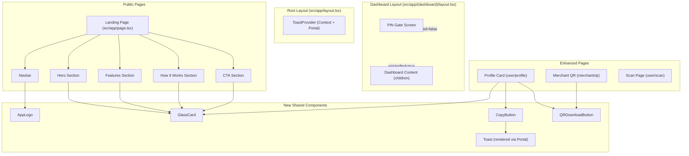
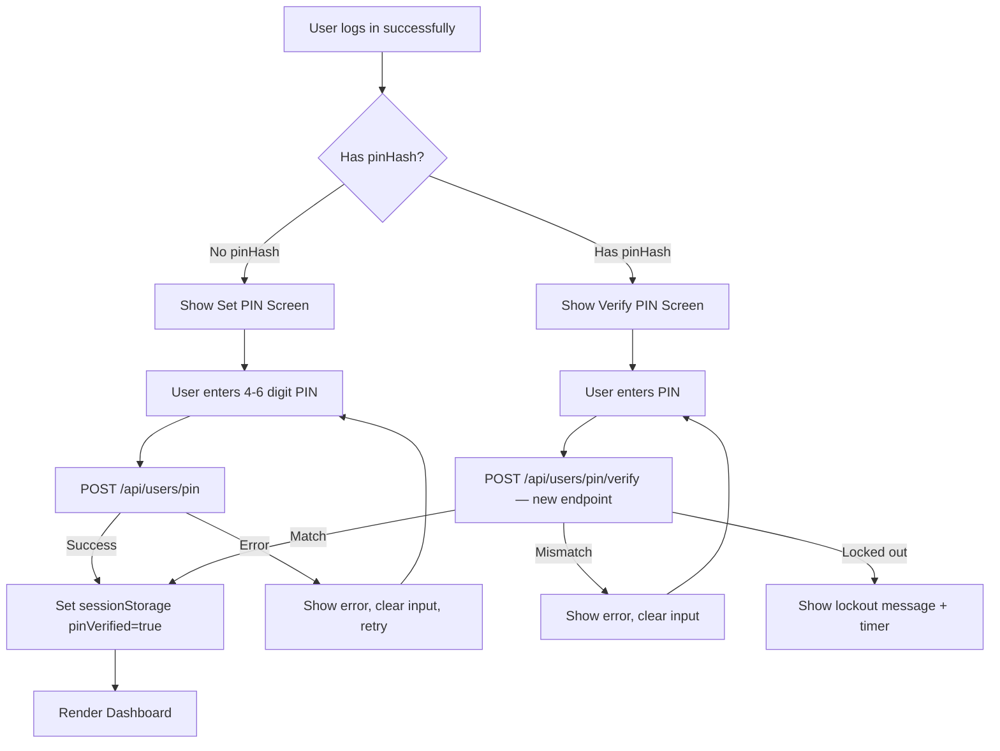
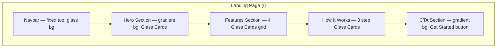
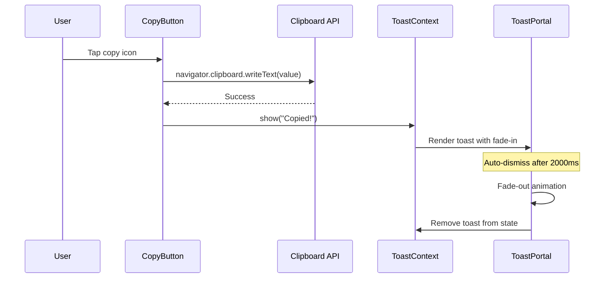

# Design Document: StellarPe UI Overhaul

## Overview

This overhaul transforms StellarPe from a functional prototype into a polished, production-ready fintech product. The changes span three categories:

1. **New public-facing Landing Page** — A glassmorphism-styled marketing page with Navbar, Hero, Features, How It Works, and CTA sections, replacing the current root redirect to `/login`.
2. **New reusable components and interactions** — Glass Card, App Logo, Toast notifications, QR download as PNG, copy-to-clipboard with feedback, and an enhanced Profile Card.
3. **Bug fixes and UX hardening** — QR Scanner camera/permission handling, mandatory PIN gate after login, UI consistency (spacing, alignment, responsiveness), and a global glassmorphism design system in Tailwind CSS.

### Key Design Decisions

1. **Glassmorphism via Tailwind utilities, not a component library.** We define reusable CSS custom properties and `@apply`-based utility classes in `globals.css`. This keeps the bundle small, avoids a new dependency, and lets every component opt in with a single class name (e.g., `glass-card`). Existing components (Card, Button, Input, PinInput) remain untouched — backward compatibility is a hard constraint.

2. **No Framer Motion in the initial build.** The requirements list Framer Motion as optional. We achieve entrance animations and hover transitions with CSS `@keyframes`, `transition`, and `IntersectionObserver`. This avoids adding ~30 kB to the client bundle. Framer Motion can be introduced later if richer orchestration is needed.

3. **QR download via `html-to-image` or canvas-based approach.** The existing `QRCodeSVG` from `qrcode.react` renders an inline SVG. We convert it to a PNG using a lightweight `<canvas>` draw — no new dependency required. The canvas approach uses `XMLSerializer` to serialize the SVG, draws it onto a canvas at 512×512, and triggers a download via a temporary `<a>` element.

4. **PIN Gate as a client-side route guard in the Dashboard layout.** The existing `DashboardLayout` already reads `localStorage` for auth. We extend it with a `pinVerified` session flag (stored in `sessionStorage`, not `localStorage`, so it resets per tab). If the flag is absent, the layout renders the PIN Gate screen inline instead of `children`. This avoids a new route and keeps the guard impossible to bypass via direct URL navigation.

5. **Toast via React Context + Portal.** A `ToastProvider` wraps the root layout and renders toasts in a portal at the bottom-center of the viewport. Components call `useToast().show(message)` to trigger a toast. This is simpler than a pub/sub event bus and integrates naturally with React's rendering model.

6. **QR Scanner fixes via explicit `navigator.mediaDevices` checks.** The current `QRScanner` component initializes `html5-qrcode` without checking for camera availability or handling permission denial gracefully. We add pre-flight checks using `navigator.mediaDevices.getUserMedia` with proper error discrimination (NotAllowedError, NotFoundError, NotReadableError) and a retry mechanism.

---

## Architecture

### Component Architecture



### PIN Gate Flow



### Landing Page Section Layout



### Toast Notification Flow



---

## Components and Interfaces

### New Components

#### AppLogo (`src/components/AppLogo.tsx`)

```typescript
export interface AppLogoProps {
  /** Render size in pixels. Scales the SVG proportionally. Default: 40 */
  size?: number;
  /** Optional additional CSS classes */
  className?: string;
}
```

Renders a stylized "S" letter with a gradient fill (`from-indigo-500 to-purple-600`) inside a glass-effect rounded container. Implemented as an inline SVG with `viewBox` so it scales without pixelation from 24px to 128px. Uses CSS custom properties from the global theme for gradient colors.

#### GlassCard (`src/components/ui/GlassCard.tsx`)

```typescript
export interface GlassCardProps extends React.HTMLAttributes<HTMLDivElement> {
  /** Content to render inside the card */
  children: React.ReactNode;
  /** Optional additional CSS classes for style overrides */
  className?: string;
}
```

A `<div>` that applies the glassmorphism style: semi-transparent background (`rgba(255, 255, 255, 0.15)`), `backdrop-filter: blur(12px)`, `border: 1px solid rgba(255, 255, 255, 0.2)`, and a soft shadow. Accepts `children` and `className`. Forwards refs via `forwardRef`. Does **not** replace the existing `Card` component — `Card` remains for opaque white cards on dashboard pages.

#### Toast System (`src/components/ui/Toast.tsx` + `src/contexts/ToastContext.tsx`)

```typescript
// Context API
export interface ToastContextValue {
  show: (message: string, duration?: number) => void;
}

// Toast component props (internal)
interface ToastItemProps {
  id: string;
  message: string;
  duration: number; // default 2000ms
  onDismiss: (id: string) => void;
}
```

`ToastProvider` wraps the root layout. It maintains a `toasts: ToastItem[]` state array. Each toast gets a unique ID, renders in a portal attached to `document.body`, positioned `fixed bottom-20 left-1/2 -translate-x-1/2` (above BottomNav). Uses `role="status"` and `aria-live="polite"` for screen reader announcements. Fade-in/fade-out via CSS transitions (200ms).

#### CopyButton (`src/components/CopyButton.tsx`)

```typescript
export interface CopyButtonProps {
  /** The string value to copy to clipboard */
  value: string;
  /** Accessible label for the button. Default: "Copy to clipboard" */
  label?: string;
  /** Optional additional CSS classes */
  className?: string;
}
```

An icon button (clipboard SVG icon) that calls `navigator.clipboard.writeText(value)` on click and triggers `useToast().show("Copied!")`. Falls back to `document.execCommand('copy')` for older browsers. Shows a brief checkmark icon for 1.5s after successful copy.

#### QRDownloadButton (`src/components/QRDownloadButton.tsx`)

```typescript
export interface QRDownloadButtonProps {
  /** Ref or selector to the container holding the QRCodeSVG element */
  qrRef: React.RefObject<HTMLDivElement>;
  /** Filename for the downloaded PNG (without extension) */
  filename: string;
  /** Download resolution in pixels. Default: 512 */
  resolution?: number;
  /** Optional additional CSS classes */
  className?: string;
}
```

On click: serializes the SVG inside `qrRef.current` via `XMLSerializer`, creates an `Image` from the SVG data URL, draws it onto a `<canvas>` at the specified resolution, calls `canvas.toDataURL('image/png')`, and triggers a download via a temporary `<a>` element. No external dependency needed.

#### ProfileCard (`src/components/ProfileCard.tsx`)

```typescript
export interface ProfileCardProps {
  username: string;
  walletId: string;
  stellarAddress: string;
}
```

A `GlassCard` containing: the user's avatar placeholder (initials circle), username, Wallet ID with adjacent `CopyButton`, a `QRCodeDisplay` encoding the Stellar address, and a `QRDownloadButton` below the QR code. Styled with the glassmorphism theme.

### Landing Page Sections

All landing page sections are server components where possible (no `'use client'` unless animations require it). They live in `src/app/page.tsx` as a single-page composition or as extracted components under `src/components/landing/`.

| Component | File | Props | Notes |
|-----------|------|-------|-------|
| `Navbar` | `src/components/landing/Navbar.tsx` | — | Fixed top, glass bg, AppLogo left, Login button right |
| `HeroSection` | `src/components/landing/HeroSection.tsx` | — | Gradient bg, heading, tagline, 2 CTA buttons, decorative GlassCards |
| `FeaturesSection` | `src/components/landing/FeaturesSection.tsx` | — | 4 GlassCards in responsive grid |
| `HowItWorksSection` | `src/components/landing/HowItWorksSection.tsx` | — | 3 step GlassCards with step numbers |
| `CTASection` | `src/components/landing/CTASection.tsx` | — | Gradient bg, heading, Get Started button |

### Modified Components

#### QRScanner (`src/components/QRScanner.tsx`) — Enhanced

Changes:
1. Add pre-flight `navigator.mediaDevices.getUserMedia({ video: true })` check before initializing `html5-qrcode`.
2. Discriminate error types: `NotAllowedError` → permission denied UI, `NotFoundError` → no camera UI, `NotReadableError` → camera in use UI.
3. Add a "Retry" button that re-runs the initialization sequence.
4. Ensure `scanner.clear()` is called on unmount and on navigation away (already partially done, but needs hardening with a `mounted` flag and error swallowing).

#### Dashboard Layout (`src/app/(dashboard)/layout.tsx`) — PIN Gate Integration

Changes:
1. After confirming auth, check `sessionStorage.getItem('pinVerified')`.
2. If not verified, check `user.pinHash` from localStorage.
3. Render `PinGateScreen` (set or verify mode) instead of `children`.
4. On successful PIN action, set `sessionStorage.setItem('pinVerified', 'true')` and re-render.

#### Root Layout (`src/app/layout.tsx`) — ToastProvider

Changes:
1. Wrap `{children}` with `<ToastProvider>`.
2. Update metadata (title: "StellarPe", description: appropriate fintech copy).

#### User Profile Page (`src/app/(dashboard)/user/profile/page.tsx`)

Changes:
1. Replace the inline user info card with `ProfileCard` component.
2. Add `CopyButton` next to Wallet ID.
3. Add `QRCodeDisplay` with personal QR code.
4. Add `QRDownloadButton` below QR code.
5. Apply glassmorphism styling via `GlassCard`.

#### Merchant QR Page (`src/app/(dashboard)/merchant/qr/page.tsx`)

Changes:
1. Add `QRDownloadButton` next to each QR code display.
2. Add `CopyButton` next to the Stellar address display.

#### Transaction List (`src/components/TransactionList.tsx`)

Changes:
1. Add `CopyButton` next to `stellarTxId` display for each transaction.

### New API Endpoint

#### POST `/api/users/pin/verify` — Verify PIN without mutation

```typescript
// Request body
{ pin: string }

// Response 200
{ verified: true }

// Response 401
{ error: "Incorrect PIN", attemptsRemaining: number }

// Response 423
{ error: "Account locked", lockedUntil: string }
```

This endpoint calls `PINService.verifyPin()` and returns the result. It's needed because the existing `POST /api/users/pin` sets a new PIN, and `PUT /api/users/pin` resets it — neither simply verifies. The PIN Gate needs a verify-only endpoint.

---

## Data Models

No database schema changes are required for this overhaul. All new state is client-side:

| State | Storage | Scope | Purpose |
|-------|---------|-------|---------|
| `pinVerified` | `sessionStorage` | Per browser tab | Tracks whether the user has completed PIN verification in the current session |
| Toast queue | React state (Context) | Per app instance | Manages active toast notifications |
| QR download canvas | Ephemeral DOM | Per action | Temporary canvas for PNG generation, cleaned up after download |

The existing data models (User, Wallet, Transaction, Contact, MerchantProfile) remain unchanged. The `user.pinHash` field (already nullable in the schema) is used to determine whether to show the "Set PIN" or "Verify PIN" screen in the PIN Gate.

### Global CSS Theme Additions (`src/app/globals.css`)

```css
/* Glassmorphism Design System */
:root {
  --glass-bg: rgba(255, 255, 255, 0.12);
  --glass-border: rgba(255, 255, 255, 0.2);
  --glass-shadow: 0 8px 32px rgba(0, 0, 0, 0.1);
  --glass-blur: 12px;
  --gradient-primary-from: #6366f1; /* indigo-500 */
  --gradient-primary-to: #9333ea;   /* purple-600 */
  --gradient-accent-from: #3b82f6;  /* blue-500 */
  --gradient-accent-to: #6366f1;    /* indigo-500 */
}

.glass-card {
  background: var(--glass-bg);
  backdrop-filter: blur(var(--glass-blur));
  -webkit-backdrop-filter: blur(var(--glass-blur));
  border: 1px solid var(--glass-border);
  box-shadow: var(--glass-shadow);
  border-radius: 1rem;
}

.gradient-primary {
  background: linear-gradient(135deg, var(--gradient-primary-from), var(--gradient-primary-to));
}

.gradient-accent {
  background: linear-gradient(135deg, var(--gradient-accent-from), var(--gradient-accent-to));
}
```

These utilities are consumed by `GlassCard`, `AppLogo`, landing page sections, and PIN Gate screens. Existing components (`Card`, `Button`, `Input`, `PinInput`) are not modified — they continue using their current opaque white/gray Tailwind classes.


---

## Correctness Properties

*A property is a characteristic or behavior that should hold true across all valid executions of a system — essentially, a formal statement about what the system should do. Properties serve as the bridge between human-readable specifications and machine-verifiable correctness guarantees.*

### Property 1: AppLogo scales proportionally for any valid size

*For any* integer size value between 24 and 128 (inclusive), rendering the AppLogo component with that size prop should produce an inline SVG element whose rendered width and height both equal the specified size in pixels, with no pixelation or clipping.

**Validates: Requirements 7.2, 7.3**

### Property 2: GlassCard renders arbitrary children and applies className

*For any* React children content (text string, nested elements) and *for any* valid CSS className string, rendering a GlassCard with those props should produce a container that includes the children in its DOM subtree and has the provided className in its class list, in addition to the base glassmorphism classes.

**Validates: Requirements 8.2**

### Property 3: QR PNG download produces correct dimensions

*For any* QR code data string and *for any* resolution value ≥ 512, the QR download function should produce a PNG data URL whose decoded image has width and height both equal to the specified resolution.

**Validates: Requirements 9.2**

### Property 4: QR PNG round-trip preserves encoded data

*For any* valid Stellar address string (56 characters, starting with 'G'), generating a QR code SVG encoding that address, converting it to a PNG via the canvas-based download function, and then decoding the PNG should produce the original Stellar address string unchanged.

**Validates: Requirements 9.2, 9.3**

### Property 5: CopyButton copies exact string to clipboard

*For any* non-empty string value passed to the CopyButton component, triggering the copy action should result in the clipboard containing exactly that string, with no truncation, whitespace modification, or encoding changes.

**Validates: Requirements 10.2, 10.4**

### Property 6: Toast auto-dismisses after configured duration

*For any* duration value between 1500 and 3000 milliseconds, showing a Toast with that duration should result in the Toast being removed from the DOM after the specified duration has elapsed (±100ms tolerance), and the Toast should be present in the DOM before that duration.

**Validates: Requirements 10.5, 15.2**

### Property 7: PIN Gate displays correct screen based on user PIN state

*For any* authenticated user object, if the user's `pinHash` field is null or absent, the PIN Gate should render the "Set PIN" screen; if the user's `pinHash` field is a non-empty string, the PIN Gate should render the "Verify PIN" screen. In both cases, the dashboard content should not be visible.

**Validates: Requirements 14.1, 14.2**

### Property 8: PIN Gate prevents dashboard access when session is unverified

*For any* dashboard route path (e.g., `/user`, `/user/send`, `/merchant`, `/merchant/qr`) and *for any* authenticated user whose session does not have the `pinVerified` flag set, attempting to render that route should display the PIN Gate screen instead of the dashboard content.

**Validates: Requirements 14.3**

---

## Error Handling

### QR Scanner Errors

| Error Type | Detection | User-Facing Message | Recovery |
|-----------|-----------|---------------------|----------|
| `NotAllowedError` | `getUserMedia` rejection | "Camera access denied. Please enable camera permissions in your browser settings to scan QR codes." | Manual — user must update browser settings |
| `NotFoundError` | `getUserMedia` rejection | "No camera found. QR scanning requires a device with a camera." | None — hardware limitation |
| `NotReadableError` | `getUserMedia` rejection | "Camera is in use by another application. Please close other apps using the camera and try again." | "Retry" button re-initializes scanner |
| Runtime stream error | `onerror` on MediaStream | "Camera encountered an error. Please try again." | "Retry" button re-initializes scanner |
| `html5-qrcode` init failure | `catch` on scanner init | "Failed to initialize QR scanner." | "Retry" button |

### PIN Gate Errors

| Scenario | API Response | User-Facing Behavior |
|----------|-------------|---------------------|
| Invalid PIN format (not 4-6 digits) | Client-side validation | Inline error: "PIN must be 4 to 6 digits" — input cleared |
| Incorrect PIN | 401 `{ error, attemptsRemaining }` | Inline error: "Incorrect PIN. X attempts remaining." — input cleared |
| Account locked | 423 `{ error, lockedUntil }` | Lockout message with countdown timer — input disabled |
| Network error | `catch` on fetch | Inline error: "Network error. Please try again." — input cleared |
| Set PIN API failure | 400/500 | Inline error with API message — input cleared |

### Clipboard Errors

| Scenario | Detection | Fallback |
|----------|-----------|----------|
| `navigator.clipboard` unavailable | Feature detection | Fall back to `document.execCommand('copy')` with a temporary textarea |
| `writeText` rejected (permissions) | `catch` on promise | Toast: "Unable to copy. Please copy manually." |
| Insecure context (HTTP) | `navigator.clipboard` is undefined | Fall back to `execCommand` approach |

### QR Download Errors

| Scenario | Detection | User-Facing Behavior |
|----------|-----------|---------------------|
| SVG element not found in ref | Null check on `qrRef.current` | Button disabled or error toast: "QR code not available for download" |
| Canvas drawing failure | `catch` on canvas operations | Toast: "Failed to generate QR image. Please try again." |
| Image load failure | `onerror` on Image element | Toast: "Failed to process QR code for download." |

### Toast Edge Cases

- Multiple toasts: Queue them vertically, newest at bottom. Maximum 3 visible at once; older toasts are dismissed early.
- Rapid-fire toasts: Debounce identical messages within 500ms to prevent spam.
- Navigation during toast: Toasts persist across client-side navigations since they're rendered in the root layout portal.

---

## Testing Strategy

### Unit Tests (Example-Based)

Unit tests cover specific UI rendering, interactions, and edge cases. These use Jest + React Testing Library (already configured in the project).

**Landing Page Components:**
- Navbar renders AppLogo and Login button
- HeroSection renders heading, tagline, and both CTA buttons
- FeaturesSection renders exactly 4 feature cards with correct content
- HowItWorksSection renders exactly 3 steps
- CTASection renders heading and Get Started button
- Navigation: Login button → `/login`, Get Started → `/register`

**New Shared Components:**
- AppLogo renders SVG with gradient at default size
- GlassCard applies glassmorphism CSS classes
- Toast renders with `role="status"` and `aria-live="polite"`
- Toast positioning classes (bottom-center, above BottomNav)
- CopyButton shows clipboard icon, switches to checkmark on success
- QRDownloadButton renders download icon button

**QR Scanner Fixes:**
- Permission denied → fallback UI with instructions
- No camera → unsupported device message
- Runtime error → error message + Retry button
- Unmount → camera streams stopped

**PIN Gate:**
- Set PIN screen renders PinInput when pinHash is null
- Verify PIN screen renders PinInput when pinHash exists
- Successful PIN set → sessionStorage flag + dashboard render
- Incorrect PIN → error message + cleared input
- Lockout → disabled input + countdown message

**Profile Enhancements:**
- ProfileCard renders username, Wallet ID, copy button, QR code, download button

**Backward Compatibility:**
- Existing Card, Button, Input, PinInput components render unchanged after CSS additions

### Property-Based Tests

Property-based tests use `fast-check` (already in devDependencies) with a minimum of 100 iterations per property. Each test references its design document property.

| Property | Test Description | Generator Strategy |
|----------|-----------------|-------------------|
| Property 1 | AppLogo scales for any size | `fc.integer({ min: 24, max: 128 })` for size |
| Property 2 | GlassCard renders children + className | `fc.string()` for className, `fc.string({ minLength: 1 })` for children text |
| Property 3 | QR PNG dimensions | `fc.string({ minLength: 1, maxLength: 200 })` for QR data, `fc.integer({ min: 512, max: 2048 })` for resolution |
| Property 4 | QR PNG round-trip | `fc.string({ minLength: 56, maxLength: 56 }).filter(s => /^G/.test(s))` for Stellar addresses |
| Property 5 | CopyButton clipboard fidelity | `fc.string({ minLength: 1, maxLength: 500 })` for values |
| Property 6 | Toast auto-dismiss timing | `fc.integer({ min: 1500, max: 3000 })` for duration |
| Property 7 | PIN Gate screen selection | `fc.record({ pinHash: fc.option(fc.string({ minLength: 1 })) })` for user state |
| Property 8 | PIN Gate route blocking | `fc.constantFrom('/user', '/user/send', '/merchant', '/merchant/qr')` for routes |

**Tag format for each test:**
```
// Feature: stellarpe-ui-overhaul, Property {N}: {property_text}
```

### Integration Tests

- Landing page full render: all sections present and scrollable
- PIN Gate → Dashboard flow: login → PIN Gate → verify → dashboard accessible
- Copy + Toast flow: copy action → clipboard updated → toast appears → toast dismisses
- QR download flow: QR displayed → download button → PNG file triggered

### Test Configuration

- Test runner: Jest (already configured via `jest.config.ts`)
- Component testing: React Testing Library
- Property testing: fast-check v4 (already in devDependencies)
- Minimum 100 iterations per property test
- Mock `navigator.clipboard` and `navigator.mediaDevices` for browser API tests
- Mock `sessionStorage` for PIN Gate tests
